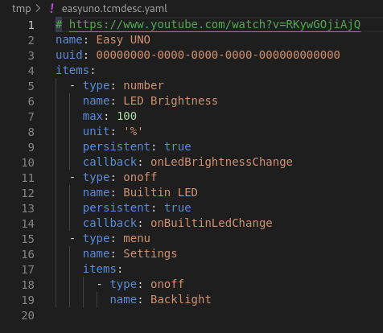

# mktcmenu

A minimal, headless menu descriptor code generator for TcMenu.



## IMPORTANT

This project has no affiliation with The Coders Corner. Please **DO NOT** asking for support via TcMenu support channels (e.g. forums and GitHub issues) for any mktcmenu related issues. If you have enough reason to believe that the cause of a specific issue was from TcMenuLib, please first **minimally reproduce** it in **official TcMenu Designer** before filing an issue on **TcMenuLib's issue tracker**. If the same issue cannot be reproduced with the official Designer, feel free to open an issue **here** instead so I can take a look.

Also for commercial use of the TcMenu library with mktcmenu see below (search "commercial use" on this page).

## Improvements over the official TcMenu Designer (at least to me)

- Text-based descriptor format optimized specifically for readability and writing experience.
- Only generates the menu descriptor entries aka. things that are actually painful to write and maintain by hand and nothing platform/peripheral-specific unless absolutely necessary.
  - This means no initialization code/LCD backend code is generated and you have to write those by hand. (It's usually just one-off and not that hard! Check [TcMenu's documentation](https://www.thecoderscorner.com/products/arduino-libraries/tc-menu#display-plugins), [TcMenu code examples](https://github.com/davetcc/tcMenuLib/commits/master/examples) and [menu generator source code](https://github.com/davetcc/tcMenu/tree/master/tcMenuGenerator/src/main/resources/packaged-plugins) for details.)
  - In exchange you got better support for "unsupported hardware" that works perfectly in reality.
- Simple and fully automagic EEPROM management (just write `persistent: true`) with append-only allocation strategy for out-of-the-box backwards compatibility.
- Runs headlessly (although the official designer has this pending too).
- Hopefully better integration with PlatformIO.
- Was a great way for me to learn the "gotchas"/documentation bugs of TcMenu.
- No more asking for registration upon every start (evil laugh).
  - Apparently for commercial use of TcMenu you have to register with TCC (see https://github.com/davetcc/tcMenu/issues/87#issuecomment-828440985). So please do that in the official TcMenu Designer at least once if you somehow decided to use mktcmenu in your commercial projects.

## Difference of generated code over TcMenu Designer

- Instead of outputting the main header as `<menu-name>_menu.h`, this generator outputs it simply as `<menu-name>.h` where the menu name is the same as the basename of the tcmdesc file.
- There's no `setupMenu()` function that does platform+menu+peripheral-specific initialization, instead the necessary objects for initializing the menu are provided in several objects and functions.
  - The root node of the menu is wrapped in a constexpr function for easy referencing (`constexpr MenuItem *getRootMenuItem()`).
  - Default menu visibilities, etc. are set with `setupMenuDefaults()`, call this right before the actual menu initialization routine.
- The menu back item has names started with `menuback` instead of `menuBack` for simplified name anti-collision.
- Callback prototypes are defined in `<menu-name>_callback.h` but the main header file should include it.
  - The nonsense `CALLBACK_FUNCTION` that does nothing is removed since callbacks should all start with descriptive names anyway.
- Anything that aren't exposed in the header are defined as static when possible for even more name anti-collision.
  - One exception is the `RENDERING_CALLBACK_NAME_INVOKE` [macro](https://github.com/davetcc/tcMenuLib/blob/1f9c4ce3f6bca2904b7586574e2501e3723e8d9c/src/RuntimeMenuItem.h#L453-L468)
- The generated code should be fully namespace-compatible and will likely be in its own namespace sometime later.


## Use it with PlatformIO

TODO

## Use the schema

mktcmenu uses a JSON schema to validate the supplied tcmdesc files. The schema can also be used with editors like VSCode to ease the editing of tcmdesc file.

To set it up in VSCode, add the following to your `settings.json`:

```
    "yaml.schemas": {
        "/path/to/mktcmenu/mktcmenu_schemas/tcmdesc.schema.json": "*.tcmdesc.yaml"
    }
```

Replace `/path/to/mktcmenu` with absolute or relative (in case of workspace specific configuration) path to the mktcmenu project root.

## TODO

- More menu item types (i.e. most of the MultiPart entries).
- Better error handling and tcmdesc linting.
- EEPROM mapping consistency check (overlaps, etc.).
